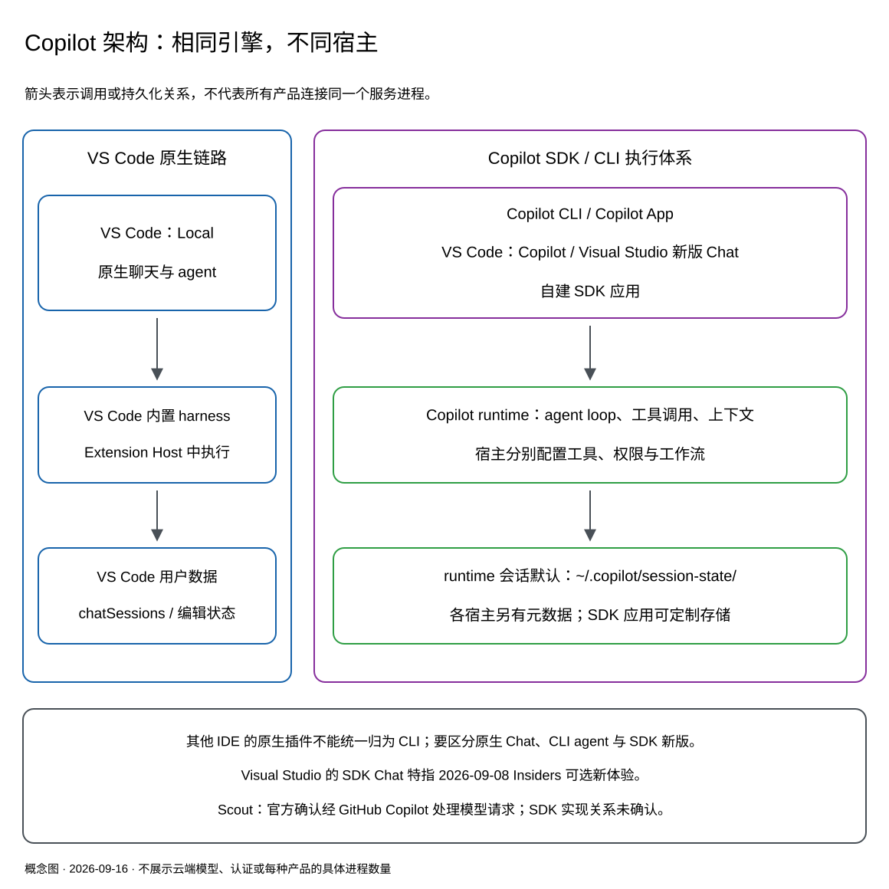

# GitHub Copilot 产品、架构与会话管理入门

> **适用读者**：第一次系统了解 Copilot 的开发者、技术负责人，以及准备把 Copilot 接入自建应用的工程师。
>
> **资料截点**：2026-09-16。VS Code 实现细节以 **1.138.0** 源码为基线；CLI、App、SDK 的产品行为以检索当日官方资料为准。界面名称、默认设置与灰度功能可能随版本、账号和组织策略变化。
>
> **Session 范围**：重点讨论本机落盘的对话、执行历史和配套状态；只在解释跨端访问时涉及云端副本。这里的 session **不是登录态或认证 token**。

## 阅读导航

| 你想解决的问题 | 建议先读 |
|---|---|
| 这么多 Copilot，到底是什么关系？ | [1. 架构总览](#1-架构总览) |
| 我应该用哪一种？ | [2. 产品与适用场景](#2-产品与适用场景) |
| 同样的模型，为什么两端能力不同？ | [3. 工具集与宿主能力](#3-工具集与宿主能力) |
| 聊天存在哪里，能否跨产品继续？ | [4. Session 的四层数据](#4-session-的四层数据)至[6. 会话互通](#6-会话互通) |
| reindex 和远程开发怎么工作？ | [7. Chronicle](#7-chronicle-与-reindex)、[8. 远程开发与 `/ide`](#8-远程开发与-ide) |
| 如何安全地恢复、迁移和排查历史？ | [9. 使用与维护建议](#9-使用与维护建议) |

本文用三种证据口径：**官方确认**指官方文档或公开源码；**社区观察**指特定版本的用户实测；**未确认**指证据不足。未确认不等于“不存在”，但不能当作稳定产品契约。

## 1. 架构总览

### 1.1 先记住这五句话

1. **Copilot 不是一个单独模型，也不是只有一种客户端。** 它提供 IDE 插件、终端工具、桌面应用，以及供开发者集成的 SDK。
2. **CLI、Copilot App、VS Code 的 Copilot harness 和 SDK 应用复用同一类 Copilot 执行引擎，但不等于连接同一个进程。**
3. **VS Code 的 Local 与 Copilot 是两种 harness。** Local 使用 VS Code 内置执行链路；Copilot 通过 SDK 接入 Copilot runtime。
4. **复用 runtime 不等于工具、权限和工作流完全相同。** 每个宿主都可以提供自己的能力与状态。
5. **能看到历史、能打开会话、能继续执行，是三个不同层级的能力。** 不存在覆盖所有产品的通用本地 session 文件格式。



图中右侧表示**复用执行实现的产品家族**，不是一个被所有客户端共用的服务进程。SDK 应用可以定制存储，不能据图推断一定使用默认目录。Scout 的 SDK 实现关系尚未获得直接官方证据，因此没有归入该链路。[可编辑 Excalidraw 源文件](copilot-architecture-assets/copilot-architecture.excalidraw)可在 [Microsoft Excalidraw](https://aka.ms/excalidraw) 中打开。

### 1.2 把几个容易混淆的名词分开

| 名词 | 通俗解释 | 不要混淆成 |
|---|---|---|
| **Model，模型** | 根据上下文生成回答或提出工具调用请求的模型 | 整个 Copilot 产品 |
| **Harness / runtime，执行层** | 准备模型输入、运行 agent loop、调用工具、处理权限和上下文的软件 | 模型本身；或一个固定不变的公共进程 |
| **Host，宿主** | 承载执行层并提供集成能力的环境，例如 App、VS Code Extension Host、Agent Host | Git 仓库或云模型服务 |
| **Tool，工具** | agent 可调用的能力，例如读取文件、运行测试、创建会话、查询业务系统 | 仅仅一个按钮或 slash command |
| **Agent role，角色** | Ask、Plan、Agent 或自定义 agent 的指令与行为配置 | 一定切换了 runtime |
| **Execution environment，执行环境** | 工具实际运行的机器、容器或云环境 | 模型的推理位置 |
| **Workspace / worktree** | Workspace 是工作上下文；Git worktree 是一份可独立修改的检出目录 | 安全沙箱；或会话历史本身 |
| **Session / chat / turn** | Session 是工作单元；可包含一个或多个独立 chat；turn 是一次交互回合 | 所有产品里严格一一对应的同一种对象 |

**Local 是 harness 的名字，不表示离线推理。** Copilot harness 也能在本地机器运行，而两种 harness 都可能请求云端模型。不同产品中的 Plan、Autopilot 等名称，也不保证具有完全一样的审批语义。

当前 VS Code 的 Agent Host 会话可以包含多个 chat，它们共享 workspace/worktree，但各有对话历史。因此应区分 **App/Host 的工作单元 ID** 和 **底层 runtime 的对话 ID**，不要只凭字段都叫 `sessionId` 就视为相同。[架构概念][vscode-harnesses]、[多 chat 与 session][vscode-sessions]

### 1.3 一次 agent 请求怎样执行

```text
用户输入任务
    -> 宿主补充项目、选区、规则和可用工具
    -> harness 请求模型
    -> 模型回答，或提出工具调用
    -> 权限检查 -> 工具执行 -> 将结果交回模型
    -> 重复以上循环，直到完成或等待用户
    -> 保存对话/事件，并按配置更新索引与同步副本
```

例如，“修复测试失败”并不是模型直接修改电脑：模型提出操作，runtime 与宿主根据工具定义、权限和环境执行它们，再把结果送回模型。

## 2. 产品与适用场景

### 2.1 快速选型

| 形态 | 主要定位 | 优先使用的场景 | 需要知道的边界 |
|---|---|---|---|
| **Copilot CLI** | 在终端中运行 coding agent | SSH 开发、命令行工作流、脚本和自动化、熟悉终端的开发者 | 不自动拥有某个 App 或 IDE 的全部专属工具 |
| **VS Code：Local** | 深度结合编辑器的内置 harness | 交互式修改代码、使用编辑器上下文和扩展提供的能力 | 原生会话存储不同于 CLI |
| **VS Code：Copilot** | 在编辑器中使用 Copilot harness | 希望结合 CLI 执行能力、Agent Host 会话和图形审阅 | 与 Local 的工具、审批、会话生命周期可能不同 |
| **其他 IDE 的 Copilot 插件** | 在现有 IDE 中补全、聊天和执行受支持的 agent 任务 | 团队已使用 JetBrains、Visual Studio、Xcode 或 Eclipse | 各 IDE 的功能和持久化实现不完全一致 |
| **GitHub Copilot App** | 面向多任务的软件工作台 | 并行处理项目、会话、分支、PR，使用 Canvas 和自动化 | 有自己的项目与会话管理层，不是 CLI 的纯图形皮肤 |
| **Microsoft Scout** | 面向更广泛工作任务的个人 AI 助手 | 跨应用、工作信息与日常任务协作；取决于产品可用性 | 官方确认通过 Copilot 处理模型请求；SDK 实现关系与跨产品会话兼容性未确认 |
| **GitHub Copilot SDK** | 把 Copilot agent 能力接入自己的程序 | 内部助手、业务应用、自动化服务、自建前端 | 开发者负责业务授权、工具实现、数据隔离与宿主状态 |

此处“其他 IDE 插件”指 **GitHub 官方面向第三方 IDE 提供的 Copilot 集成**，不是任意社区开发的同名插件。

### 2.2 CLI：独立的终端产品

当前产品的可执行命令是 `copilot`。不要和旧 GitHub CLI 扩展中的 `gh copilot suggest` / `gh copilot explain` 混淆，也不要因为都带有 `gh` 或 Copilot 名称就认为它们有同一套历史。

CLI 负责终端交互，并使用 Copilot runtime 管理 agent loop、会话、工具和上下文。它既能交互式使用，也可以程序化运行。终端工具适合接近代码和测试环境的工作，但服务化使用仍要单独处理账号、权限、隔离和计费，不能简单让所有用户共用一个个人开发目录。[CLI 官方仓库][cli-repo]、[旧扩展说明][old-cli]

### 2.3 VS Code：同一界面下有不同执行链路

| 维度 | Local | Copilot |
|---|---|---|
| 核心执行实现 | VS Code 内置 harness；Copilot 扩展含 agent/tool loop | Copilot SDK / CLI runtime |
| 当前主要宿主 | Extension Host | Agent Host |
| 编辑器集成 | 直接利用 VS Code 的工具与扩展上下文 | 通过宿主适配和客户端工具接入；并非每个编辑器工具都可用 |
| 核心会话存储 | VS Code Core 的聊天与编辑状态 | CLI runtime 会话，加上 Host/VS Code 管理状态 |
| 窗口生命周期 | 依赖窗口/扩展宿主，不应假定关闭后继续执行 | Host 管理会话，可由不同客户端观察和控制 |

**Agent Host 不是另一个 Copilot 模型，也不等于 CLI。** 它是 VS Code 用来管理 agent 会话的宿主层，通过 AHP（Agent Host Protocol）与客户端通信；可适配 Copilot、Claude、Codex 等执行实现。Copilot 适配器通过 SDK 使用 Copilot runtime。

Host 存活时，活动会话可以在没有编辑器客户端连接的情况下继续；这不代表关闭电脑或退出所有相关进程后任务仍会执行。旧版本及已有 session 可能仍使用 Extension Host 集成，不能仅看 VS Code 版本就认定所有历史会话都已迁移。[Agent Host 架构][agent-host]、[VS Code Copilot adapter][vscode-copilot-agent]

### 2.4 其他 IDE 插件：产品体验相似，不代表内部实现相同

JetBrains、Visual Studio、Xcode、Eclipse 中的 Copilot 通常利用所在 IDE 的项目、编辑器和语言服务提供帮助。补全、聊天、Agent、MCP 等功能的支持情况，应查看对应 IDE 和插件版本，而不是把 VS Code 的能力列表原样复制过去。

特别要区分：**JetBrains 原生 Copilot Chat** 与 **在 JetBrains 中启动的 Copilot CLI agent**。它们可以在同一个会话视图出现，但不因此共用原生聊天数据库。也没有足够证据表明所有 IDE 的原生 Copilot 插件都已经改用 CLI runtime。[IDE 使用文档][ide-docs]、[JetBrains CLI agent 公告][jetbrains-cli]

这条边界也在演进：**Visual Studio 2026-09-08 Insiders 的可选新版 Chat 已明确基于 Copilot SDK**，覆盖 Ask、Agent 与聊天基础设施。它是具体版本的 SDK 集成，不能推广到旧 Chat 或所有 Visual Studio 安装。[Visual Studio Insiders 发布说明][visual-studio-sdk]

### 2.5 Copilot App：runtime 之外还有工作管理层

App 官方确认基于 Copilot CLI。它增加项目发现、会话与工作区管理、GitHub 集成、Canvas、自动化和多任务协调等能力。创建会话时可以选择本地目录、独立 worktree 或受支持的云环境；并不是每次聊天都创建 worktree。

因此，App 与 CLI 的差异不仅在 UI，还在于 **agent 能操作的宿主对象、可用工具、权限和生命周期**。同一个 runtime 在不同宿主里可以表现成不同产品。[App 产品说明][app-overview]、[App 会话管理][app-sessions]

### 2.6 Scout 与 SDK：不要把底层能力当成完整产品

Microsoft Scout 是面向 Windows/macOS 的行动型桌面助手，处于 Frontier 预览。它可结合文件、shell、浏览器与 Microsoft 365/Work IQ 能力完成多步骤任务，不限于代码编辑。Work IQ 提供跨 Microsoft 365 信息的查询与综合能力，不是 Scout 的另一个名字。[Scout 概览][scout-overview]、[Scout 能力与数据说明][scout-data]

**Scout 与 SDK 的关系需要保留证据边界。** 官方 FAQ 明确说 Scout 经 GitHub Copilot 处理模型请求；但本次核实的 FAQ、Overview 和官方资源仓库 README 均没有明确声明它基于 Copilot SDK。因此本文不把“Scout 已确认是 SDK 应用”写成事实，也不反向断言它没有使用 SDK。[Scout FAQ][scout-faq]、[官方资源仓库][scout-resources]

SDK 则是开发接口，不是一个必须单独打开的聊天客户端。官方支持 TypeScript/Node.js、Python、Go、.NET、Java 和 Rust。标准集成通过 SDK 与 Copilot CLI server 进行 JSON-RPC 通信；SDK 可以管理 runtime 子进程，也可以连接已有服务。是否随包安装 CLI、如何连接以及支持哪些选项，取决于 SDK 语言和版本。[SDK 官方架构][sdk-repo]

应用可以注册自己的工具、选择模型、管理会话 ID，并建立用户、任务、业务系统与 runtime session 的映射。**SDK 给的是 agent 能力，不会自动给应用补齐账号授权、业务 UI、后台任务管理或跨租户隔离。** [SDK 多用户部署][sdk-multitenancy]

Scout 的当前官方产品资料和本地存储证据边界见[第 5.4 节](#54-其他-ide-与-scout-的已知存储)。

## 3. 工具集与宿主能力

**同一个模型、同一类 runtime，不保证同样的任务表现。**

| 能力来源 | 例子 | 由谁提供或决定 |
|---|---|---|
| Runtime 内置能力 | 文件操作、shell、上下文压缩等 | Runtime 版本及配置 |
| 宿主工具 | 操作 App 管理的会话、项目、Canvas，读取 IDE 选区或 diagnostics | App、IDE 或自建程序 |
| MCP / 插件 | 查询工单、数据库、云资源 | 已配置的服务、插件和凭据 |
| Instructions / skills / agent 定义 | 团队规范、工作流程、领域知识 | 项目、用户和组织配置 |
| 权限与 hooks | 是否允许某次编辑、命令或外部操作 | 宿主策略、用户审批和组织要求 |

SDK 允许通过 `tools` 注册工具，通过 `availableTools` / `excludedTools` 控制可用范围，通过 MCP 配置扩展能力，并通过权限回调与 hooks 干预执行。参数名称和行为以对应版本为准。[SDK 类型定义][sdk-types]

MCP（Model Context Protocol）是一种连接工具和外部服务的协议，不是“自动获得所有系统访问权”。服务仍需要安装/配置，并按其身份与授权执行。

所以：

- **App 的工具集不必然是 CLI 的严格超集。** CLI 也能扩展，且两端可能采用不同版本和配置。
- **相同工具名不保证实现相同。** 一端的操作可能由宿主管理并带有审批，另一端可能只是 shell 命令。
- **保存了工具调用记录，不等于保存了工具实现。** 在 CLI 恢复 App 历史后，App 的 Canvas、业务服务或内存状态不会从日志里自动“长出来”。
- **Instructions 不等于权限控制。** “请不要修改某文件”是行为指导，不能替代实际访问限制。

还要区分**代码隔离与权限隔离**：当前 VS Code 文档中的 Copilot **New Worktree** 会话使用 **Allow all**；需要手工审批时应选择支持 **Manual permissions** 的 Folder 模式。Worktree 分开了代码修改，但不自动限制 shell 或网络访问。[权限与代码隔离说明][vscode-harnesses]

## 4. Session 的四层数据

不要把“有一个 session 文件夹”理解成“这个任务的一切都在里面”。

| 数据层 | 保存什么 | 典型例子 |
|---|---|---|
| **对话与 runtime 历史** | 消息、工具调用、事件、计划、checkpoint | CLI `session-state/`；VS Code `chatSessions/` |
| **宿主元数据** | 标题、分组、项目关联、chat 与 backend ID 映射、归档状态 | App 项目数据库；Agent Host 管理状态 |
| **查询索引** | 为搜索和统计提取的结构化子集 | Chronicle `session-store.db` |
| **工作成果与执行环境** | 仓库文件、未提交修改、分支、依赖、后台进程 | 实际项目目录、Git worktree、容器 |

云同步可能再建立服务端会话表示或分析索引，但它**不是自动备份全部 worktree、依赖和本地进程**。

**磁盘历史也不等于模型的当前上下文。** 长会话可能经过筛选、摘要和压缩，不是每次请求都把全部历史发送给模型。Memory 保存可跨会话使用的信息；instructions、skills 则提供规则或流程，它们也不是聊天正文。

### 4.1 常见生命周期操作

| 操作 | 应怎样理解 |
|---|---|
| Create | 新建工作单元或对话；空会话是否立即写盘依实现而定 |
| Resume | 加载已有状态继续；仍需要可用的 runtime、工具和工作目录 |
| Rename | 修改标题，不等于改变底层 ID |
| Compact | 压缩后续模型请求的上下文；不等于删除整份磁盘历史 |
| Fork | 从历史产生新会话或新 chat；是否另建 worktree 由宿主决定 |
| Archive | 宿主层的归档；可能伴随工作区清理，不能一概等同于“只隐藏” |
| Disconnect / Dispose | SDK 通常释放连接或内存句柄，保留可恢复的磁盘数据 |
| Delete | 删除指定范围的数据；本地、云端、宿主记录和工作文件可能是不同删除范围 |

CLI 的常见入口包括 `copilot --resume`、`/resume`、`/rename`、`/compact`、`/session`；具体参数查看当前 `/help`。App 和 VS Code 的归档、fork 与恢复由各自 UI 和 provider 实现。不要假设每种形态支持完全一样的 slash commands。[CLI 命令参考][cli-commands]

## 5. 本地存储位置与管理机制

### 5.1 CLI 与默认 SDK runtime

默认根目录是执行 runtime 的用户的 home 下的 `.copilot`：

| 平台 | 默认根目录 |
|---|---|
| macOS | `$HOME/.copilot` |
| Linux / SSH 服务器 / 容器内用户 | `$HOME/.copilot`，这里的 home 属于该执行环境 |
| Windows | 通常为 `%USERPROFILE%\.copilot` |

可以用 `COPILOT_HOME` 改写。SDK 启动 runtime 时，也可以使用对应的 base-directory 配置；连接已有 runtime 时由服务端决定存储根。

SDK 应用还可能使用 `sessionFs` 等自定义持久化能力，此时不应按默认目录推断它的完整数据位置。

```text
~/.copilot/
├── session-state/
│   └── <runtime-session-id>/
│       ├── events.jsonl
│       ├── workspace.yaml
│       ├── checkpoints/          # 按需出现
│       ├── plan.md               # 按需出现
│       └── files/                # artifacts，按需出现
├── session-store.db              # Chronicle 查询索引
├── ide/                          # IDE 集成发现信息，不是聊天正文
├── logs/                         # 运行日志
└── settings.json                 # 用户配置，不是聊天正文
```

`events.jsonl` 包含用户、助手、工具等事件；`workspace.yaml` 保存 cwd、标题和会话上下文等元数据。完整字段会随版本变化，不应把它们当作稳定的公共写入 API。`checkpoints/` 和 `files/` 不保证包含整个代码仓库。[目录参考][cli-config]、[VS Code 对 CLI 文件的读取定义][cli-paths]、[SDK 持久化][sdk-persistence]

文件格式的简要区别：**JSONL** 把 JSON 记录逐行追加，**YAML/JSON** 保存结构化状态，**SQLite** 是可用 SQL 查询的数据库。扩展名相同不代表字段或用途兼容。

SDK 应用还需要自己保存 **用户/业务任务 → runtime session ID** 的映射，并在恢复时重新提供工具实现及所需的认证、权限配置。`disconnect()` 与 `deleteSession()` 的含义不同，前者不是删除磁盘历史。

**关于随机 ID 的注意事项**：部分 SDK 指南把显式 `sessionId` 作为可恢复会话的示范；当前 Node SDK 源码在未指定本地 ID 时也会生成 UUID。因此不要武断理解为“不指定 ID 就绝不落盘”。可靠做法是保存实际返回的 ID，并核对所用 runtime 的持久化行为。[SDK 客户端实现][sdk-client]

### 5.2 VS Code Local：原生聊天与 Chronicle 分开存

macOS Stable 默认的原生聊天存储为：

```text
~/Library/Application Support/Code/User/
├── workspaceStorage/<workspace-id>/
│   ├── workspace.json
│   ├── state.vscdb
│   ├── state.vscdb.backup
│   ├── chatSessions/
│   │   ├── <session-id>.jsonl
│   │   └── <session-id>.json       # 兼容旧格式，不一定两份都有
│   └── chatEditingSessions/<session-key>/
│       ├── state.json
│       └── contents/
└── globalStorage/
    └── emptyWindowChatSessions/   # 未打开工作区的聊天
```

- `workspace.json` 标明工作区位置，可用于反查目录。
- `state.vscdb` 保存工作区状态，包括 `chat.ChatSessionStore.index`，不是全部聊天正文。
- `chatSessions/*.jsonl` 是对象状态的增量日志，不是 CLI `events.jsonl` 的同一种 schema。
- `chatEditingSessions/` 保存编辑状态及文件内容快照，不等于真实源文件。
- 1.138.0 的原生 store 设有 400 条持久化会话的裁剪上限；不要把它当作无限归档。

Insiders 将 `Code` 换为 `Code - Insiders`；Windows 通常使用 `%APPDATA%\Code\User`，Linux 通常使用 `~/.config/Code/User`。`--user-data-dir`、Portable Mode 等会改变位置。[原生 store 源码][vscode-chat-store]、[编辑状态源码][vscode-edit-store]

Chronicle 是另一个存储体系：

```text
<Copilot扩展的工作区 storageUri>/debug-logs/<session-id>/main.jsonl
<Copilot扩展的 globalStorageUri>/debug-logs/<session-id>/main.jsonl
<Copilot扩展的 globalStorageUri>/session-store.db
```

在普通 Mac 本地窗口中，全局数据库通常展开为：

```text
~/Library/Application Support/Code/User/globalStorage/github.copilot-chat/session-store.db
```

工作区日志位于 `workspaceStorage/<id>/<扩展ID>/debug-logs/`；扩展 ID 的大小写、profile 和宿主位置应以实际目录为准。**这个数据库既不是 `state.vscdb`，也不是 `~/.copilot/session-store.db`。** [扩展数据库创建位置][vscode-services]、[日志根目录][vscode-debug-logs]

### 5.3 VS Code Copilot 与 Copilot App

**VS Code Copilot harness** 使用 CLI runtime 会话，默认在运行环境的 `.copilot/session-state/`。VS Code 和 Agent Host 还会维护发现、工作区、会话与 chat 的关联等配套状态。新版 Agent Host 与旧扩展宿主集成的旁路元数据可能不同。

**Copilot App** 同样复用 CLI runtime 的会话能力，但还有自己的项目、workspace、会话列表和归档等数据。公开文档不足以把各平台的全部 App 内部数据库路径列为稳定契约。因此本文不把“App 所有数据都在 `.copilot`”或“App 只读 CLI 的同一个数据库”当作结论。

**同一个 runtime 家族，默认数据位置可以相通，但宿主元数据不会自动相同。** 这也是“CLI 能列出、App 侧边栏却看不到”可能发生的原因。[Copilot adapter][vscode-copilot-agent]、[App 会话说明][app-sessions]

### 5.4 其他 IDE 与 Scout 的已知存储

| 产品 | 本地持久化可确认到什么程度 | 证据边界 |
|---|---|---|
| **Xcode** | 官方源码使用 SQLite；以用户和 workspace 区分数据库 | 可确认原生聊天路径与表结构，不代表能被 CLI 直接恢复 |
| **JetBrains 原生 Agent/Chat** | 插件支持历史管理；CLI agent 另按 CLI 机制判断 | 未确认覆盖当前所有会话类型的原生正文路径与 schema |
| **Visual Studio** | 有聊天线程/历史；新版 SDK Chat 与旧 Chat 要分开 | 本文未确认各版本受支持的完整本地正文路径 |
| **Eclipse** | 官方源码在插件 `stateLocation` 下保存按用户名分组的 JSON，以及 XML 索引 | 已确认持久化结构；不是社区 Copilot4Eclipse 的实现 |
| **Microsoft Scout** | 官方说明会话和记忆保存到用户 OneDrive；会话历史按设备分别存放，可搜索和恢复 | 不能据此推断统一的本机缓存路径或与 CLI 共用数据库 |

Xcode 的公开实现给出的路径为：

```text
${XDG_CONFIG_HOME:-$HOME/.config}/github-copilot/xcode/
  <GitHub用户名的SHA256前16位>/
    conversations/
      <workspace路径的SHA256前16位>.db
```

数据库包含 `Conversation`、`Turn` 等表，消息结构作为 JSON 数据持久化。路径变化或换账号可能对应不同数据库；目录名的哈希不是加密或访问控制。`XDG_CONFIG_HOME` 需要是受实现接受的绝对路径。[Xcode 配置路径][xcode-paths]、[Xcode conversation 存储][xcode-storage]、[表结构][xcode-schema]

Eclipse/Equinox 的默认工作区布局下，正文与索引路径为：

```text
<Eclipse-workspace>/.metadata/.plugins/com.microsoft.copilot.eclipse.core/
└── conversations/<username>/
    ├── conversation_index.xml
    └── <conversationId>.json
```

这里的 `<Eclipse-workspace>` 是 **Eclipse 工作区的数据根，不是单个工程目录**。插件通过 `stateLocation` 获取上述状态根，再追加用户名和会话文件名；定制运行环境可能改变物理位置。[Eclipse 官方持久化实现][eclipse-storage]、[插件 ID][eclipse-bundle]、[Equinox 状态目录实现][equinox-data]

Scout 的官方资料将**生成的工作文件、会话/记忆、自动化指令和工具输出**分别说明：工作文件在 workspace；会话与记忆在 OneDrive；自动化指令和工具输出在设备。即使使用 OneDrive，其会话历史仍按设备分别存储，不等于所有设备自动共享同一条活动会话。[Scout 数据说明][scout-data]、[Scout 会话历史][scout-history]

早期 Clawpilot 实机文章中的 `m-sessions` 等目录，不应直接当作当前 Scout 的默认规范。闭源 IDE 插件也不能根据“通常的缓存目录”去猜聊天正文位置。

## 6. 会话互通

### 6.1 先问清楚“互通”是哪一层

| 层级 | 能力 | 仍然不代表 |
|---|---|---|
| **发现 / 列表** | UI 知道某个 session 存在 | 已读到完整历史 |
| **查看 / 查询** | 能显示 transcript 或搜索历史数据 | 本机已经具备可恢复 runtime 状态 |
| **Resume / handoff** | 能带着历史继续工作 | 原宿主的工具、进程、文件和权限全部还在 |
| **完整执行环境恢复** | 恢复代码、依赖、配置与所需服务 | 任意客户端可以无条件互换 |

**共享格式、UI 导入、Chronicle 查询、云同步、远程控制，是不同机制。**

### 6.2 主要组合的实际关系

| 组合 | 可以怎样互通 | 不应作出的推断 |
|---|---|---|
| **CLI ↔ App** | 兼容的 runtime session 可被恢复；App 有 CLI 导入层；CLI `/app` 可请求在 App 打开当前会话 | App 会自动显示所有 CLI session |
| **CLI ↔ SDK 应用** | 相同存储环境、兼容 runtime、已知 ID 时可通过 session API 继续 | 任意 SDK 应用都使用默认目录，或恢复后工具自动齐全 |
| **CLI/App ↔ VS Code Copilot** | VS Code 可发现受支持的外部会话，并由 Agent Host 接管；受发现和筛选规则影响 | 一个全局进程同时承载所有客户端；所有历史必然出现 |
| **VS Code Local ↔ Copilot harness** | 新版支持会话 handoff；原生 Chat 另有导入/导出机制 | CLI 直接解析 `chatSessions/*.jsonl` 就能通用恢复 |
| **其他 IDE 原生 Chat ↔ CLI/App** | 取决于特定集成、云端能力或显式导入 | 所有原生聊天数据库可直接互读 |
| **Scout ↔ CLI/App** | 官方提供 Scout 内的历史搜索/恢复；未确认与 CLI/App 的通用会话恢复 | Scout 的业务上下文、应用状态和工具都能迁移 |

同名 `sessionId` 不应被当成全产品统一命名空间；自建系统应记录来源产品、宿主 ID、runtime ID 和执行位置。[VS Code 外部会话发现][vscode-manage-sessions]、[SDK 恢复机制][sdk-persistence]

### 6.3 为什么 App 创建的会话能在 CLI 看见，反过来却不行

App 默认并非把 runtime 中每条历史都放进侧边栏。先检查：

**Settings → Sessions → Show Copilot CLI Session**

官方 changelog 说明该设置默认 **Off**，开启后还按所选历史时间范围显示。v1.1.10 修复了 Off 仍自动导入最近七天会话的问题；v1.1.13 增加了 180 天与 360 天选项。[App 发布记录][app-changelog]

如果已开启且日期符合，仍需排查项目关联和版本问题。社区在 App 1.1.14/Linux 报告过缺少仓库元数据、`client_name` 改变而无法重新导入的情况；这是**特定版本观察，不是通用规则**。[github/app#3346][app-import-issue]

不要把删除项目、手改 `workspace.yaml` 或清空数据库当作首选修复。只想打开某一条会话时，可以在 CLI 中使用 `/app`；官方要求 App 1.1.3+。Chronicle reindex 不保证修复 App 的侧边栏关联。

### 6.4 云同步不是把所有本地文件复制一份

CLI 官方说明默认会同步 session 数据，但可通过 `settings.json` 中的 `remoteExport: false` 关闭；Business/Enterprise 还受 “Store local sessions in the Cloud” 策略约束。

对 Business/Enterprise，官方要求组织至少允许 **View from cloud**；策略未配置或已禁用时只做本地会话存储。允许同步本身不赋予管理员读取个人会话内容的权限。

VS Code 提供 `chat.sessionSync.enabled` 和 `chat.sessionSync.excludeRepositories`。**应查看实际生效值和同步状态，不要只凭一篇文章假定默认开或关**：截至本文截点，新版用户文档写为默认开启，而 1.138.0 源码基值仍是 `false`，并允许实验配置覆盖。[VS Code 同步文档][vscode-history]、[对应源码][vscode-sync-setting]

同步后可以跨受支持客户端查询历史；能否继续执行还取决于该会话类型、恢复流程、工作区和工具是否可用。

- VS Code **Settings Sync** 与 **Copilot session sync** 不是同一个功能。
- 关闭未来同步，不会自动删除已经上传的历史。
- CLI 本地批量删除与云端删除不是同一操作；官方 `/session delete-all`、`prune` 不会删除云端副本。
- GitHub cloud agent 原本就是服务端任务；远程控制则可能只是远端界面控制一台仍在线的执行机器。

本文不把这些机制统称为“所有产品已经共享一个 session store”。[CLI session 数据说明][cli-chronicle]

**关闭历史同步也不等于离线运行**：当你让 Copilot 根据历史回答问题时，相关文本仍可能作为模型请求的上下文发送出去。历史存储位置和模型处理位置要分别评估。

## 7. Chronicle 与 reindex

Chronicle 是**基于历史会话的搜索和分析能力**，可用于工作总结、查找之前的修改、改进指令或分析使用情况。它不是源代码索引、代码补全缓存或 Git 仓库索引。

CLI/App 常用 `/chronicle reindex`；VS Code 当前原生提示词入口为 **`/chronicle:reindex`**，也可在命令面板运行 **Reindex Sessions**。名称以当前自动补全为准，不要把三端的 slash command 解析方式当作同一种实现。

### 7.1 三个入口分别做什么

| 入口 | 主要读取 | 主要更新 | 范围与限制 |
|---|---|---|---|
| **CLI** | 当前 runtime 的 `<COPILOT_HOME>/session-state/` | `<COPILOT_HOME>/session-store.db`，以及允许同步时的云端数据 | 当前机器、用户与配置根；不是遍历所有产品 |
| **VS Code 原生 Chronicle** | Copilot 扩展的 `debug-logs` | 扩展的 `globalStorageUri/session-store.db`，再按条件上传云端 | 1.138.0 扫描当前工作区和扩展全局日志根，不遍历全部工作区 |
| **App** | 官方确认使用 App/CLI 会话历史能力 | Chronicle session index | 具体内部调用链、是否还有 App 专属补录步骤未公开 |

VS Code 中如果是在集成终端运行 CLI，按 CLI 那一行理解；Agent Host 会话中的命令应按实际 provider/runtime 判断，不能只因 UI 在 VS Code 就套用原生重建器的实现。

### 7.2 VS Code 的一个关键细节

1.138.0 的重建器**读取调试日志，不读取 `chatSessions/` 原生正文**：

```text
当前工作区 debug-logs + 扩展全局 debug-logs
    -> 解析会话、对话回合、文件及外部引用
    -> 更新 Chronicle SQLite 和全文搜索内容
    -> 符合设置、仓库和策略条件时上传云端
    -> 请求云端 analytics backfill
```

默认跳过已在数据库中的 session；要求 `force` 时重新处理已有项。这里是补录/更新，不是先清空整个数据库，`force` 也不等于强制覆盖所有云端历史。

调试日志有独立的数量与大小限制，保留数量的源码默认值为 50，可被设置/实验覆盖。因此，**Chat UI 仍有历史，但相应日志已被清理时，reindex 不一定能补出旧数据**。本地阶段成功也不等于云端上传成功或服务端索引立即可查询。[重建器源码][vscode-reindex]、[工具调用链][vscode-store-tool]、[日志保留实现][vscode-debug-logs]

### 7.3 它不能替代什么

Reindex 适合补录可用历史、恢复查询数据库、补齐未写入索引的数据；它不会重新运行历史工具、恢复后台进程、重建 worktree，也不是 App 侧边栏的通用修复命令。**开启同步时，它可能上传历史内容，不是纯本地维护操作。**

## 8. 远程开发与 `/ide`

### 8.1 先确定哪些进程在远端

“在我的 Mac 上看到 VS Code”只说明 UI 在 Mac，不说明 agent、工具和全部 session 数据都在 Mac。

| 你的使用方式 | 执行/存储位置应如何判断 |
|---|---|
| Mac VS Code 打开本地项目，使用 Local | 原生正文在 Mac 的 VS Code 用户数据；扩展日志/索引也在本机扩展存储 |
| Mac VS Code Remote SSH，使用原生聊天 | 正文由 Mac 桌面 Core 保存；扩展日志/Chronicle 索引跟随实际扩展宿主，运行在远端时就在远端 |
| Mac VS Code 连接远端 Copilot Agent Host | Runtime 与工作区在 Host 一侧；默认 runtime 历史在该侧 `.copilot` |
| 另开 SSH，在服务器运行 `copilot` | CLI、代码操作和默认 session store 都在服务器该用户环境 |

浏览器版 VS Code/Codespaces 的存储不是 Mac 桌面目录模型，应单独判断。

原生 VS Code 的 workspace ID 不等于仓库 URL：本地单目录 ID 与路径/文件系统身份有关；远程单目录 ID 由完整 URI 生成。换连接别名、路径、容器身份或客户端，可能改变历史的发现结果。换一台电脑连接同一台服务器，也不会自动获得旧电脑的原生本地正文。[工作区 ID 算法][vscode-workspace-id]、[远端扩展存储路径传递][vscode-remote-storage]

### 8.2 实例：SSH CLI 干活，VS Code 只看代码

```text
Mac
  VS Code UI：文件、选区、Git diff、审批界面
        |
        | 已建立的 VS Code Remote 连接
        v
远端服务器，同一用户与可互访环境
  VS Code Server / Copilot 扩展的 IDE 集成服务
        ^
        | /ide 建立的本机 MCP 连接
        v
  另一个 SSH 终端中的 Copilot CLI
        |
        +-- 修改远端项目文件、运行测试
        +-- 保存远端 ~/.copilot/session-state/
```

**只查看已经落盘的文件和 Git diff，不需要 `/ide`。** 两端操作的是同一份远端文件，文件刷新与 Git 视图并不依赖 IDE 集成。

连接 `/ide` 后，CLI 可以额外获得：

| 能力 | 意义 |
|---|---|
| 当前编辑器选区 | 可以在 VS Code 选中代码，然后在 CLI 问“解释这段” |
| IDE diagnostics | 读取编辑器语言服务已发现的错误和警告，不必全部由 CLI 重新执行工具获取 |
| 拟议编辑 diff | 对需要审批的编辑，在 VS Code 接受/拒绝后让 CLI 继续 |
| 窗口连接管理 | 查看连接状态、切换工作区或断开 |

CLI 仍是执行主体，不会因 `/ide` 转换成 VS Code Local 会话。这个桥接也不意味着 CLI 获得了 VS Code 的所有工具。[官方 IDE 集成说明][cli-ide]

### 8.3 独立 SSH 终端怎样找到 VS Code

VS Code 的 Copilot 扩展启动 IDE 集成服务，并在运行环境的 `<COPILOT_HOME>/ide/*.lock` 记录工作区、信任状态和连接信息。1.138.0 的 Linux/macOS 实现使用带认证的 Unix socket 上的 MCP 通信。

因此，独立 SSH 启动的 CLI 也可以连接，但要满足：扩展在正确一侧启用、工作区受信任、CLI 可读取对应发现文件并访问 socket。不同用户、不同容器或不一致的 `COPILOT_HOME` 都可能阻断发现。**相同项目路径不保证相同进程/文件系统环境。** 不要公开分享 lock 文件，它包含连接认证信息。[发现文件源码][ide-lock]、[集成服务源码][ide-server]

CLI 启动时可能已经自动连接匹配窗口；`/ide` 可以确认。一条 CLI 连接只能选择一个 IDE 实例，多个窗口打开同项目时应检查目标窗口。

### 8.4 “只看修改”与“参与审批”分开配置

普通 Git diff 展示的是**已经发生的修改**；IDE 集成的拟议 diff 可能在**编辑执行前等待你审批**。如果一直只看不操作，CLI 可能就在等待。

需要编辑器选区和 diagnostics，但不想把审批搬到 VS Code，可以连接 `/ide` 后关闭 **Open file edit diffs in IDE**，继续在终端审批。

已授予免审批编辑权限时，官方说明会跳过这类拟议 diff，直接修改文件。不要为了避免弹出 diff 就开启全部工具自动批准；关闭 diff 展示与放宽执行权限是两件事。

## 9. 使用与维护建议

### 9.1 新人的起步方式

| 工作习惯 | 建议起点 |
|---|---|
| 一边写代码，一边与助手逐步讨论 | 留在熟悉的 IDE；VS Code 中根据需要选择 Local 或 Copilot |
| 主要在 SSH、shell 和测试命令之间工作 | 使用远端 CLI；需要编辑器上下文时再接 `/ide` |
| 同时推进多个仓库、分支、PR | 使用 Copilot App 或 VS Code 的受支持 Agent Host 工作流，先理解 worktree 隔离 |
| 想把 agent 放进自己的产品 | 使用 SDK；先定义工具白名单、身份映射、权限和持久化策略 |
| 重点是工作信息与跨应用任务，而非代码检出 | 评估 Scout 的当前功能、权限和可用范围 |

第一次使用时，选择一个小任务，保留关键操作审批，观察 agent 用了哪些工具，再扩大自动化范围。工具能够调用，不代表操作一定正确。

### 9.2 发现“会话丢了”时的排查顺序

1. **辨认来源**：这是 VS Code Local、CLI runtime，还是 App/Scout 的应用会话？
2. **确认位置**：在哪台机器、哪个 OS 用户、哪个容器、哪个 `COPILOT_HOME` 或 VS Code 用户数据目录？
3. **区分症状**：文件不存在、UI 没显示、Chronicle 查不到、还是 resume 报错？
4. **检查过滤**：工作区身份、App 的 CLI 导入开关、时间范围、归档和外部会话筛选。
5. **再选恢复动作**：使用产品的 resume/import/handoff，或对对应索引 reindex；不要先删数据库或手改内部字段。

在 Mac 本机终端中，下面的只读命令可以帮助把 VS Code 原生存储目录映射回项目：

```bash
find "$HOME/Library/Application Support/Code/User/workspaceStorage" \
  -name workspace.json \
  -exec grep -H -E '"(folder|workspace)"' {} +
```

它只查工作区映射，不会读取聊天正文；输出仍可能包含私有目录或主机信息，不宜未经检查就公开粘贴。

### 9.3 备份、删除与隐私

**需要备份的是多层数据，不只是一个数据库。**

- 恢复 CLI 对话通常需要原始 session 文件；只剩 Chronicle SQLite 不等于有完整可执行历史。恢复工作还需要仓库、分支、未提交修改和必要环境。
- VS Code 原生聊天与 Chronicle 日志应分别考虑；正文存在不保证所有日志仍保留。
- App/Scout 还可能需要应用元数据或系统安全存储；Scout 另涉及 OneDrive 上的历史。未确认格式时优先使用官方导出、备份与恢复入口。
- 对仍在写入的 SQLite 或事件文件做拷贝可能不一致。应让相关写入停止，或采用产品支持的一致性备份；不要随意把活动数据库放在共享同步盘上供多个 runtime 同时写。
- 不要将整个 `.copilot` 上传到公共仓库。它可能包含认证配置、MCP 凭据、内部路径和敏感聊天内容；“SDK 不在 session 中保存 provider key”不代表所有工具输出天然没有秘密。
- 删除前确认操作影响本地历史、云端副本、宿主记录还是 worktree。不要把“隐藏”“归档”“删除”当作同义词。

对 SDK 服务，session ID 只是定位键，不是授权机制。应用应根据可信的用户/租户映射检查 resume、读取和删除权限，并管理同一会话的并发。当前多用户部署指南建议使用显式工具与环境配置，而不是直接把个人 CLI 的默认能力暴露给所有租户。[SDK 多用户指南][sdk-multitenancy]

## 10. 常见误解速查

| 误解 | 更准确的理解 |
|---|---|
| Copilot 就是一个模型 | 它是多个产品与执行集成；模型只是其中一层 |
| Local 表示离线，Copilot 表示云端 | 这里是 harness 选择，执行环境和模型位置要另外判断 |
| CLI、App 和 VS Code Copilot 共用一个后台进程 | 复用实现，实例与打包版本可以不同 |
| 同一个文件夹就能双向显示所有会话 | 还取决于存储根、宿主记录、导入过滤与身份 |
| 只要都用了 SDK，工具能力就一样 | 宿主注册的工具、权限、MCP 和业务服务可能不同 |
| VS Code session 都在 `~/.copilot` | Local 原生正文和 Chronicle 扩展数据不是这套目录 |
| reindex 会恢复所有聊天和工作文件 | 它更新特定数据源的查询索引，不恢复完整执行环境 |
| `/ide` 把 CLI 变成 VS Code Local agent | 它建立 IDE 能力桥接，CLI 仍负责执行 |
| Cloud sync 与 Settings Sync 是同一个东西 | 会话同步与编辑器配置同步是两套能力 |
| 能 resume 就能完整复现原来的工作 | 还需要原工具、权限、代码状态与环境 |

## 11. 资料来源与可信度

### 官方产品与架构

- [VS Code harness 选择与执行环境][vscode-harnesses]；[Agent Host][agent-host]；[session 与多 chat][vscode-sessions]；[外部会话发现][vscode-manage-sessions]。
- [Copilot CLI 官方仓库][cli-repo]；[命令参考][cli-commands]；[配置目录][cli-config]；[CLI 与 VS Code 集成][cli-ide]。
- [Copilot App 概念][app-overview]；[会话管理][app-sessions]；[发布记录][app-changelog]。
- [Copilot SDK 架构与语言支持][sdk-repo]；[持久化指南][sdk-persistence]；[多用户部署][sdk-multitenancy]。
- [官方 IDE 使用文档][ide-docs]；[JetBrains CLI agent 与统一会话视图][jetbrains-cli]。
- [Visual Studio Insiders 的 SDK Chat][visual-studio-sdk]；[Scout 概览][scout-overview]、[FAQ][scout-faq]、[数据说明][scout-data]、[会话历史][scout-history]、[官方资源仓库][scout-resources]。
- [CLI 会话索引与同步][cli-chronicle]；[VS Code 会话同步和 Chronicle][vscode-history]。

### 固定版本实现证据

VS Code 链接固定为 `1.138.0`，用于区分当时的具体实现与产品层承诺：

- [Core 原生聊天存储][vscode-chat-store]、[编辑状态][vscode-edit-store]、[workspace ID][vscode-workspace-id]。
- [Copilot Agent Host adapter][vscode-copilot-agent]、[CLI 会话路径][cli-paths]。
- [扩展 Chronicle 数据库][vscode-services]、[调试日志][vscode-debug-logs]、[reindex][vscode-reindex]、[查询工具][vscode-store-tool]。
- [远端扩展存储路径][vscode-remote-storage]、[IDE lock 文件][ide-lock]、[IDE MCP 服务][ide-server]、[session sync 基值][vscode-sync-setting]。

Xcode 与 Eclipse 的源码链接也固定到本次核实的提交。SDK 和文档仓库的 `main` 链接可能继续变化。精确复现时，应记录自己的产品版本和对应提交，不以本文路径作为直接修改内部数据库的许可。

### 社区证据与待确认项

- [github/app#3346][app-import-issue]：特定版本的 CLI session 导入过滤实测，不是所有系统上的已确认根因。
- JetBrains 的非官方数据库路径、Scout 早期 Clawpilot 文件布局只在有明确版本和来源时参考；本文不把它们升级为稳定接口。
- Scout 经 GitHub Copilot 处理模型请求有官方依据，但所核实材料未明确说明使用 Copilot SDK；架构图不将两者画成已确认的实现依赖。
- JetBrains/Visual Studio 的完整原生正文布局、Scout 的准确本机缓存与删除联动，以及 App reindex 的全部内部步骤，仍需产品特定证据。

[vscode-harnesses]: https://github.com/microsoft/vscode-docs/blob/main/docs/agents/run/agent-harnesses.md
[agent-host]: https://github.com/microsoft/vscode-docs/blob/main/docs/agents/concepts/agent-host.md
[vscode-sessions]: https://github.com/microsoft/vscode-docs/blob/main/docs/agents/concepts/sessions.md
[vscode-manage-sessions]: https://github.com/microsoft/vscode-docs/blob/main/docs/agents/run/sessions/manage-sessions.md
[vscode-history]: https://github.com/microsoft/vscode-docs/blob/main/docs/agents/run/sessions/session-history.md
[cli-repo]: https://github.com/github/copilot-cli
[old-cli]: https://github.com/github/gh-copilot
[cli-commands]: https://github.com/github/docs/blob/main/content/copilot/reference/copilot-cli-reference/cli-command-reference.md
[cli-config]: https://github.com/github/docs/blob/main/content/copilot/reference/copilot-cli-reference/cli-config-dir-reference.md
[cli-chronicle]: https://github.com/github/docs/blob/main/content/copilot/concepts/agents/copilot-cli/chronicle.md
[cli-ide]: https://github.com/github/docs/blob/main/content/copilot/how-tos/copilot-cli/use-copilot-cli/connecting-vs-code.md
[app-overview]: https://github.com/github/docs/blob/main/content/copilot/concepts/agents/github-copilot-app.md
[app-sessions]: https://github.com/github/docs/blob/main/content/copilot/how-tos/github-copilot-app/agent-sessions.md
[app-changelog]: https://github.com/github/app/blob/main/changelog.md
[app-import-issue]: https://github.com/github/app/issues/3346
[sdk-repo]: https://github.com/github/copilot-sdk
[sdk-persistence]: https://github.com/github/copilot-sdk/blob/main/docs/features/session-persistence.md
[sdk-multitenancy]: https://github.com/github/copilot-sdk/blob/main/docs/setup/multi-tenancy.md
[sdk-types]: https://github.com/github/copilot-sdk/blob/main/nodejs/src/types.ts
[sdk-client]: https://github.com/github/copilot-sdk/blob/main/nodejs/src/client.ts
[ide-docs]: https://docs.github.com/en/copilot/how-tos/chat-with-copilot/chat-in-ide
[jetbrains-cli]: https://github.blog/changelog/2026-05-13-introducing-copilot-cli-agent-and-unified-sessions-view-in-github-copilot-for-jetbrains-ides/
[visual-studio-sdk]: https://learn.microsoft.com/en-us/visualstudio/releases/2026/release-notes-insiders#github-copilot
[scout-data]: https://learn.microsoft.com/en-us/microsoft-scout/microsoft-scout-responsible-ai-faq#how-does-microsoft-scout-handle-my-data
[scout-history]: https://learn.microsoft.com/en-us/microsoft-scout/use-microsoft-scout#use-memory-and-session-history
[scout-overview]: https://learn.microsoft.com/en-us/microsoft-scout/overview#how-it-works
[scout-faq]: https://learn.microsoft.com/en-us/microsoft-scout/faq#does-microsoft-scout-connect-to-external-models-for-processing
[scout-resources]: https://github.com/microsoft/scout-resources/blob/2adcb3a24092a243b6fb24aca8781668315e348a/README.md
[vscode-chat-store]: https://github.com/microsoft/vscode/blob/1.138.0/src/vs/workbench/contrib/chat/common/model/chatSessionStore.ts
[vscode-edit-store]: https://github.com/microsoft/vscode/blob/1.138.0/src/vs/workbench/contrib/chat/browser/chatEditing/chatEditingSessionStorage.ts
[vscode-workspace-id]: https://github.com/microsoft/vscode/blob/1.138.0/src/vs/platform/workspaces/node/workspaces.ts
[vscode-copilot-agent]: https://github.com/microsoft/vscode/blob/1.138.0/src/vs/platform/agentHost/node/copilot/copilotAgent.ts
[cli-paths]: https://github.com/microsoft/vscode/blob/1.138.0/extensions/copilot/src/extension/chatSessions/copilotcli/node/cliHelpers.ts
[vscode-services]: https://github.com/microsoft/vscode/blob/1.138.0/extensions/copilot/src/extension/extension/vscode-node/services.ts
[vscode-debug-logs]: https://github.com/microsoft/vscode/blob/1.138.0/extensions/copilot/src/extension/chat/vscode-node/chatDebugFileLoggerService.ts
[vscode-reindex]: https://github.com/microsoft/vscode/blob/1.138.0/extensions/copilot/src/extension/chronicle/node/sessionReindexer.ts
[vscode-store-tool]: https://github.com/microsoft/vscode/blob/1.138.0/extensions/copilot/src/extension/tools/node/sessionStoreSqlTool.ts
[vscode-remote-storage]: https://github.com/microsoft/vscode/blob/1.138.0/src/vs/workbench/services/extensions/common/remoteExtensionHost.ts
[vscode-sync-setting]: https://github.com/microsoft/vscode/blob/1.138.0/src/vs/workbench/contrib/chat/browser/chat.shared.contribution.ts
[ide-lock]: https://github.com/microsoft/vscode/blob/1.138.0/extensions/copilot/src/extension/chatSessions/copilotcli/vscode-node/lockFile.ts
[ide-server]: https://github.com/microsoft/vscode/blob/1.138.0/extensions/copilot/src/extension/chatSessions/copilotcli/vscode-node/inProcHttpServer.ts
[xcode-paths]: https://github.com/github/CopilotForXcode/blob/52f4f33b7105afbf09f77e3ed68c2d23765b2830/Tool/Sources/Persist/ConfigPathUtils.swift
[xcode-storage]: https://github.com/github/CopilotForXcode/blob/52f4f33b7105afbf09f77e3ed68c2d23765b2830/Tool/Sources/Persist/Storage/ConversationStorageService.swift
[xcode-schema]: https://github.com/github/CopilotForXcode/blob/52f4f33b7105afbf09f77e3ed68c2d23765b2830/Tool/Sources/Persist/Storage/ConversationStorage/ConversationStorage.swift
[eclipse-storage]: https://github.com/microsoft/copilot-for-eclipse/blob/b138f1a7cfec6aa293b6834bbe9fb5bf8e1f0235/com.microsoft.copilot.eclipse.core/src/com/microsoft/copilot/eclipse/core/persistence/ConversationPersistenceService.java
[eclipse-bundle]: https://github.com/microsoft/copilot-for-eclipse/blob/b138f1a7cfec6aa293b6834bbe9fb5bf8e1f0235/com.microsoft.copilot.eclipse.core/META-INF/MANIFEST.MF
[equinox-data]: https://github.com/eclipse-equinox/equinox/blob/fff3578521c34eb8acb792b7145634deaab1c814/bundles/org.eclipse.equinox.common/src/org/eclipse/core/internal/runtime/DataArea.java
