# GitHub Copilot 开通手册

> 本手册基于实际操作流程整理，指导企业管理员完成从创建 GitHub Enterprise 到为用户分配 GitHub Copilot 权限的全过程。

---

## 流程概览

1. 前置准备（了解 GitHub 账号体系）
2. 创建 GitHub Enterprise
3. 配置支付账户并绑定 Azure 订阅
4. 启用 GitHub Copilot 功能
5. 配置 Copilot 功能选项
6. 邀请用户到 GitHub Enterprise
7. 为用户分配 GitHub Copilot 权限
8. 预算与成本管理

---

## 一、前置准备

在开始之前，请先了解 GitHub 的用户管理体系和账号结构，确保你已具备以下条件：

- 拥有一个 GitHub 个人账号（将作为 Enterprise Owner）
- 了解 GitHub 相关的产品和价格说明
- 准备好 Azure 订阅，用于 GitHub Copilot 计费
- 如需使用 Azure 订阅付费，需要具备 Azure 管理员权限

### GitHub 账号体系说明

GitHub 的用户管理采用层级结构，从上到下依次为：

| 层级 | 说明 |
|------|------|
| **Enterprise（企业）** | 最顶层管理单元，提供统一的计费、策略管控和安全治理。一个 Enterprise 下可以管理多个 Organization。 |
| **Organization（组织）** | **可选项**，如果创建了Org，则会产生21$的额外费用。企业下的团队协作单元，用于管理代码仓库、团队和成员权限。每个 Organization 可以独立管理 Copilot 策略。 |
| **Team（团队）** | Enterprise 或者 Organization 下的分组，用于批量管理成员权限和 Copilot 许可证分配。 |
| **User（用户）** | 具体的开发者账号，可以属于多个 Organization 和 Team。 |

**关键角色说明：**
- **Enterprise Owner（企业所有者）**：拥有企业级最高权限，可管理计费、策略、Organization 等。
- **Billing Manager（计费管理员）**：可管理企业计费设置，但无法访问代码仓库。
- **Organization Owner（组织所有者）**：管理组织内成员、仓库和 Copilot 席位分配。

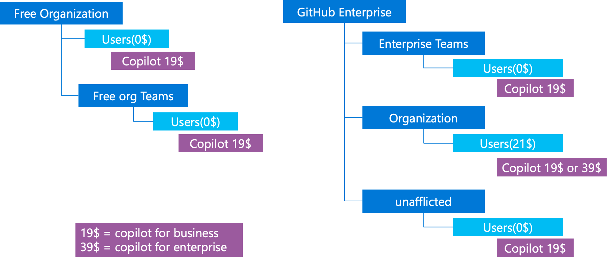

**账号体系说明：**
- 默认情况下，GH的账号都属于个人账号，哪怕是用企业邮箱注册的账号，也属于个人账号。
- GH 支持将企业的账号体系和 GH 打通，实现企业SSO账号和GH之间做映射，用户可以使用企业SSO账号登录GH。这个功能叫做 Enterprise Managed Users（EMU）。
- 本文档以个人账号的模式创建 Enterprise 为例进行说明。EMU后续会有单独的文档进行说明。

### 进入个人资料页面

登录 GitHub 后，点击右上角头像，进入个人资料设置页面。

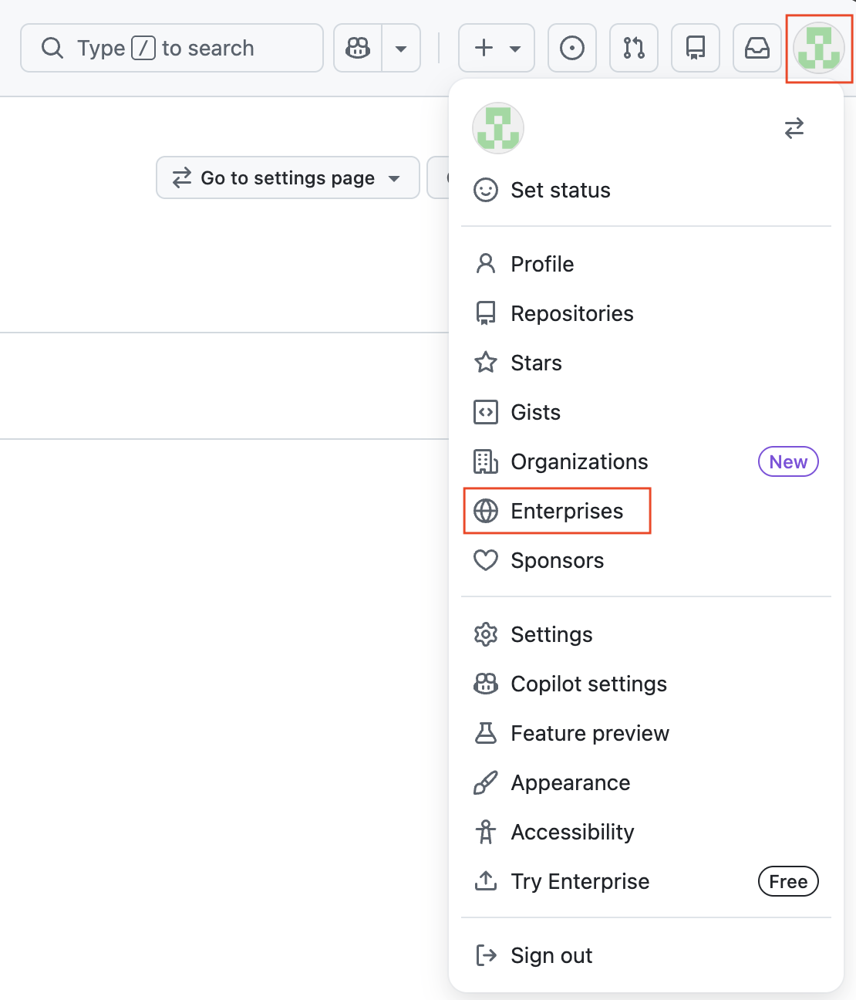

---

## 二、创建 GitHub Enterprise

### 步骤 1：进入创建 Enterprise 页面

在个人资料设置中找到创建 Enterprise 的入口，点击进入。

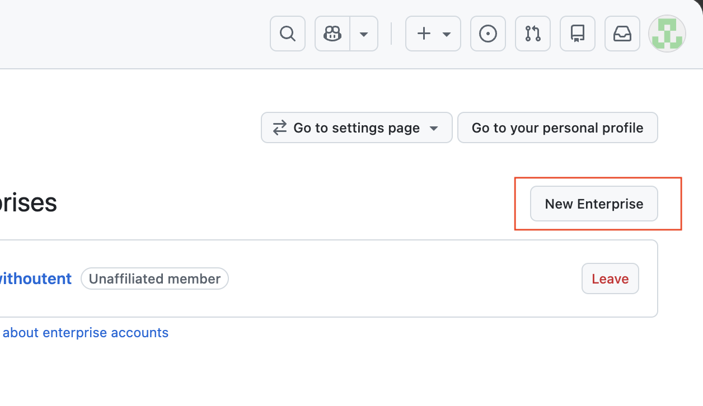

### 步骤 2：选择账号模式

根据企业需求选择合适的账号模式。（这里是个人账号，非EMU模式）

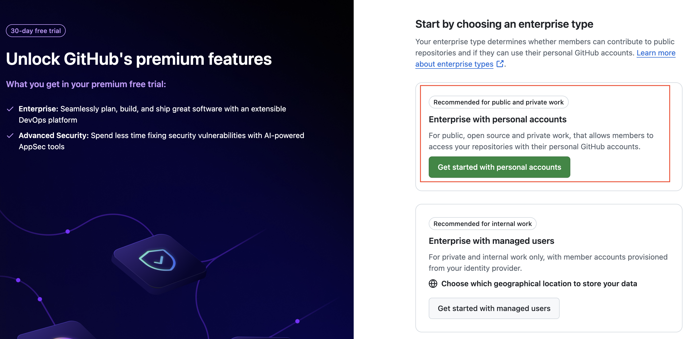

### 步骤 3：填写企业信息

输入企业名称等必要信息，创建完毕后无法修改。

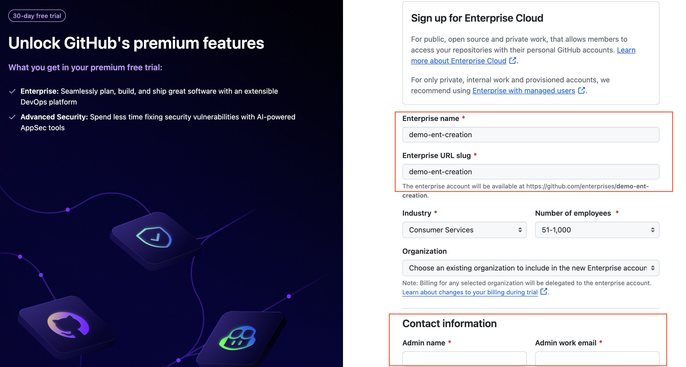

### 步骤 4：完成验证码验证

输入收到的验证码，完成身份验证。验证码会发送到上一步设置的管理员邮箱。

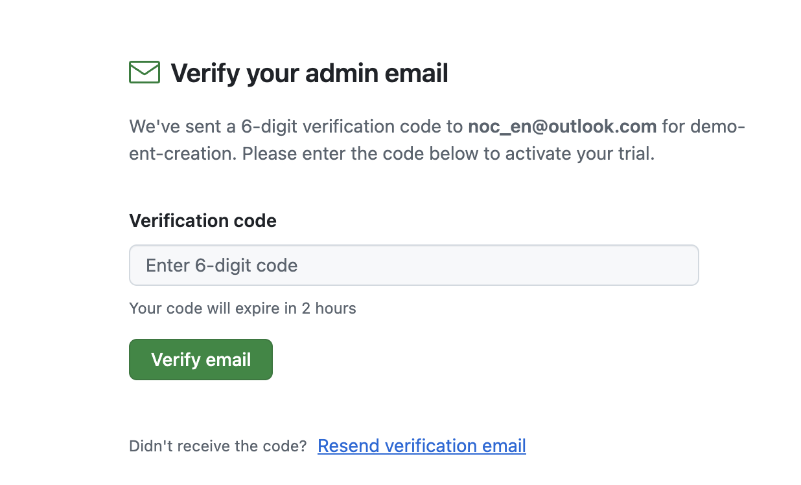

---

## 三、配置支付账户并绑定 Azure 订阅

### 步骤 5：填写支付信息

在 Enterprise 设置中，进入 Billing and licensing > Payment information，填写支付账户信息。

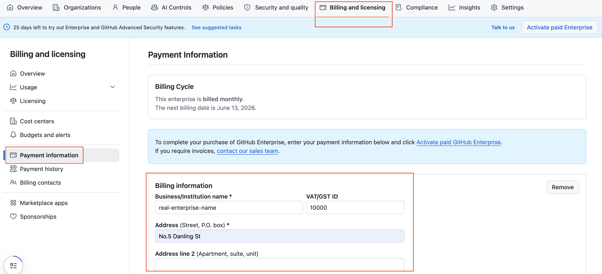

### 步骤 6：复用已有账单信息（可选）

如果之前已经配置过账单信息，可以选择复用。

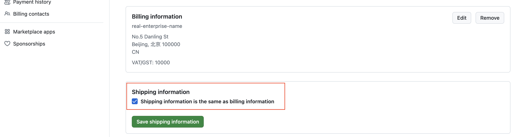

### 步骤 7：添加 Azure 订阅

在 Payment method 中选择 **Azure subscription** 标签页，点击 **Add Azure Subscription** 按钮。

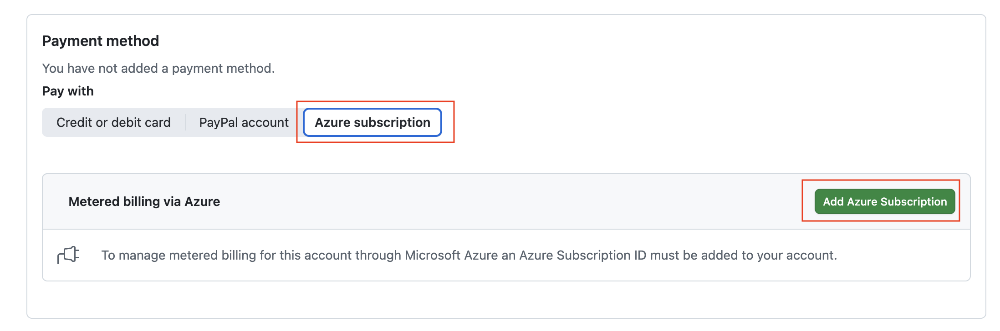

### 步骤 8：使用 Azure 管理员账号登录

系统将跳转到 Microsoft 登录页面，选择具有管理员权限的 Azure 账号进行登录授权。推荐使用类似 admin@xxx.onmicrosoft.com 格式的 Azure 管理员账号。

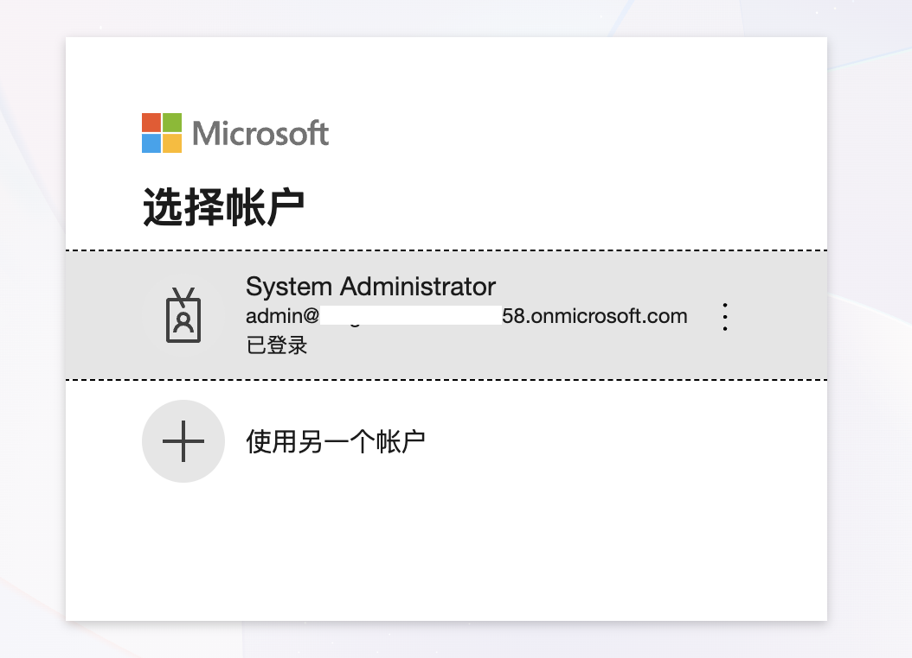

### 步骤 9：确认 Azure Billing 配置完成，并激活 Enterprise

完成授权后，返回 GitHub 设置页面，确认 Azure subscription 已成功配置并显示在 Payment information 中。

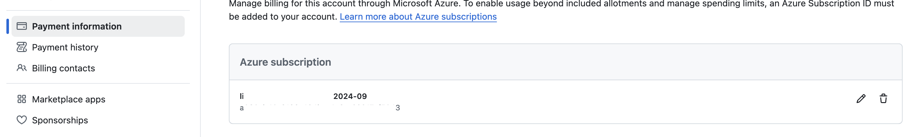

此时，点击管理页面的 **Activate Paid Enterprise** 按钮，正式激活 GitHub Enterprise。

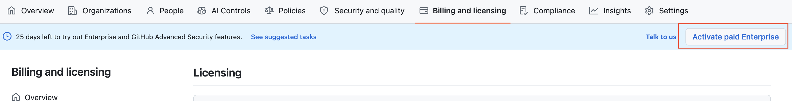

---

## 四、启用 GitHub Copilot 功能

进入 Enterprise 设置页面，导航至 **Billing and licensing > Licensing**。

向下滚动页面找到 Copilot 区域，点击绿色的 **Enable** 按钮启用 Copilot 功能。

> ⚠️ **注意**：Enable 按钮出现需要先联系 GitHub/微软销售团队开通 GitHub Copilot 功能。如果看不到 Enable 按钮，请先登陆https://support.github.com/ ，开一个enable copilot的case，然后联系销售。

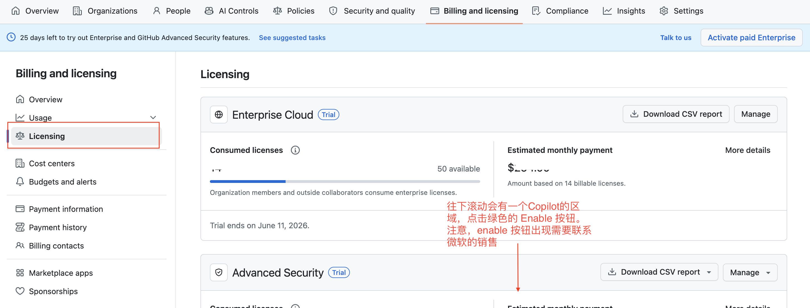

---

## 五、配置 Copilot 功能选项

启用 Copilot 后，进入 Enterprise 设置中的 **AI Controls > Copilot** 页面，配置以下选项：

- **Access management**：控制哪些组织可以访问 Copilot，或直接为用户/团队分配许可证
- **Configure allowed models**：配置允许使用的 AI 模型

> ⚠️ **重要提醒**：请注意 **Premium request paid usage** 功能默认是打开的。请根据企业预算策略确认是否需要关闭或调整此选项，以避免产生意外费用。

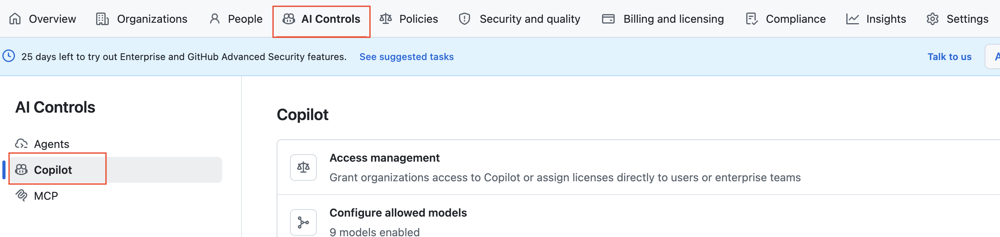

---

## 六、邀请用户到 GitHub Enterprise

### 步骤 10：发送邀请

进入 Enterprise 设置的 **People > Members** 页面，点击右上角 **Invite member** 按钮，输入用户的 GitHub 用户名或邮箱发送邀请。

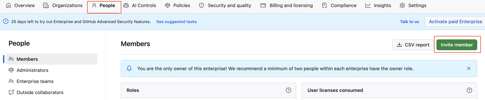

### 步骤 11：用户收到邀请邮件

被邀请用户将收到来自 GitHub（support@github.com）的 Enterprise invitation 邮件，邮件中包含加入企业的链接。

> 注意：邀请链接有效期为 **7 天**，请提醒用户及时接受。另外，邀请邮件可能会被误判为垃圾邮件，请用户注意查收邮箱的垃圾邮件文件夹。

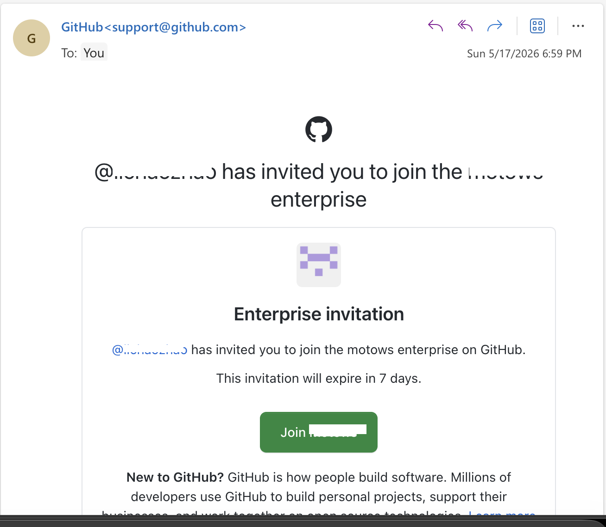

### 步骤 12：用户接受邀请

用户点击邮件中的 **Join** 按钮后，将跳转到接受邀请页面，点击 **Accept invitation** 即可加入企业。

---

## 七、为用户分配 GitHub Copilot 权限

用户加入 Enterprise 后，还需要为其分配 Copilot 许可证。

进入 **Billing and licensing > Licensing > Copilot** 页面：

1. 在 **Copilot access** 区域，配置 Organization access 控制哪些组织可以分配 Copilot 许可证
2. 在下方的成员列表中，可以按 **All members**、**Enterprise Teams** 或 **Organizations** 查看和管理
3. 点击 **Assign licenses** 按钮，为指定用户分配 Copilot 席位

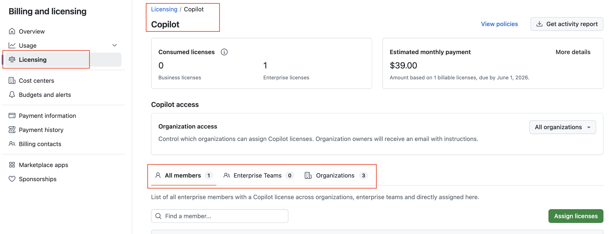

---

## 八、预算与成本管理

完成以上步骤后，建议进行预算配置以控制 Copilot 使用成本：

1. **了解 GitHub 的预算和成本中心（Cost Center）机制**：GitHub Enterprise 支持通过 Cost Center 对不同部门或团队的用量进行分组和追踪
2. **创建 Cost Center**：在 Billing and licensing > Cost centers 中创建成本中心，将组织或团队关联到对应的成本中心
3. **设置企业预算和 Cost Center 预算**：在 Billing and licensing > Budgets and alerts 中配置预算上限和告警阈值

> 注：预算管理的详细配置步骤请参考 GitHub 官方文档，本手册暂无对应截图。

---

## 检查清单

完成开通后，请逐项确认：

- [ ] GitHub Enterprise 已成功创建并激活
- [ ] Azure 订阅已绑定到 Enterprise 账单
- [ ] GitHub Copilot 功能已启用（Enable 按钮已点击）
- [ ] Copilot 功能选项已按企业策略配置
- [ ] **Premium request paid usage** 已确认是否关闭/调整
- [ ] 用户已收到邀请并成功加入 Enterprise
- [ ] 用户已被分配 Copilot 许可证（席位）
- [ ] 预算和成本中心已配置（可选但建议）

---

## 注意事项

1. **联系销售团队**：启用 Copilot 功能前需要先联系 GitHub/微软销售团队开通，否则无法看到 Enable 按钮
2. **Premium request paid usage**：此功能默认打开，可能产生超出基础订阅的额外费用，请务必根据企业预算策略决定是否保留
3. **邀请有效期**：Enterprise 邀请链接 7 天内有效，逾期需重新发送
4. **Azure 管理员权限**：绑定 Azure 订阅时，登录的账号必须具备对应 Azure 订阅的管理员权限
5. **许可证分配**：用户加入 Enterprise 不等于自动获得 Copilot 权限，需要额外在 Licensing > Copilot 中分配席位
