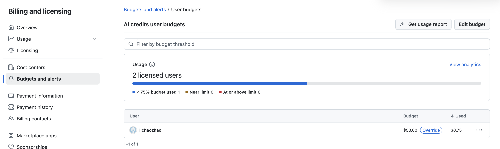
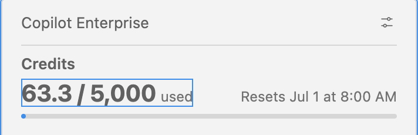
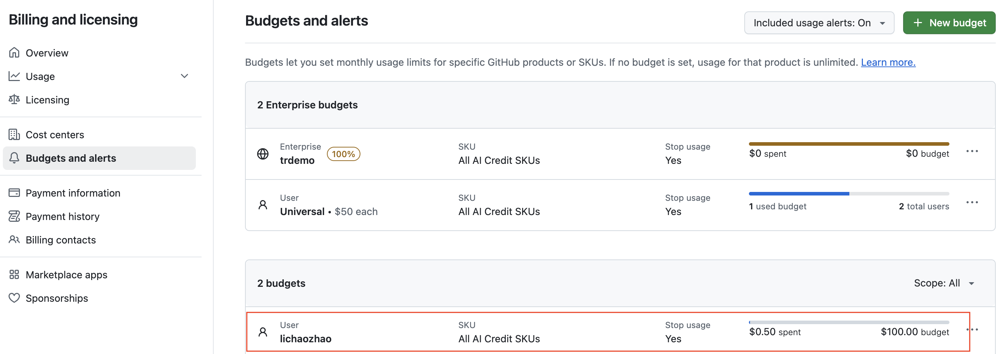

# 6月1日必须做的事情
- 如果您是free org的用户，参考：[org-must-do-on-June-1st.md](org-must-do-on-June-1st.md)
- 如果您是enterprise的用户，参考：[ent-must-do-on-June-1st.md](ent-must-do-on-June-1st.md)

# 常见问题：
> 后续会逐渐更新 
## 管理员如何查看每个人的消耗情况
- 费用查看
  入口在Budget设置页，点击universal 预算可以看到：
   

**已知问题** 
free org用户在创建好universal预算后，管理员无法看到创建的budget，需要用API来查看，参考API：
```
curl \
  -H "Accept: application/vnd.github+json" \
  -H "X-GitHub-Api-Version: 2026-03-10" \
  -H "Authorization: Bearer $PAT" \
  "https://api.github.com/orgs/$org/settings/billing/budgets"
```
正常可以看到：
```
    {
      "id": "xxx-xx-xx-xx-xxx",
      "budget_type": "BundlePricing",
      "budget_product_sku": "ai_credits",
      "budget_scope": "multi_user_customer",
      "budget_amount": 30,
      "prevent_further_usage": true,
      "budget_entity_name": "your org name",
      "budget_alerting": {
        "will_alert": true,
        "alert_recipients": [
          "admin_username"
        ]
      },
      "budget_thresholds": {

      },
      "has_next_page": null
    }
```


- Token查看，暂时未上线

## 用户如何查看自己的消耗情况
- 方法1，访问地址 https://github.com/settings/copilot/features 
- 方法2，重启vscode之后，在右下角可以查看，类似：


## 如何调整某些用户的配额 
1. 还是进入上文提到的Budget设置页
2. 创建budget
   - Budget Type选择**AI credits budget** 
   - Budget Scope选择**Users**，这里选择具体的用户
   - Budget amount 按实际预期设置，注意勾选**Stop usage when user's budget limit is reached**选项，如果不勾选则用户即使达到预算限制也可以正常使用
   - 设置完毕后，应该如图：
    

**已知问题** 
- 目前针对个人的配额预算设置界面存在bug，非EMU非GHEC的用户在UI上选不到，需要用API来设置，参考API：
  企业用户：
```
curl -X POST \
  -H "Authorization: Bearer <PAT>" \
  -H "Accept: application/vnd.github+json" \
  -H "X-GitHub-Api-Version: 2026-03-10" \
  "https://api.github.com/enterprises/{ent}/settings/billing/budgets" \
  -d '{
    "budget_type": "BundlePricing",
    "budget_product_sku": "ai_credits",
    "budget_scope": "user",
    "budget_entity_name": "user_name",
    "user": "user_name",
    "budget_amount": 25,
    "prevent_further_usage": true,
    "budget_alerting": {
      "will_alert": true,
      "alert_recipients": ["admin_username"]
    }
  }'

```
free org用户：
```
curl -X POST \
  -H "Authorization: Bearer <PAT>" \
  -H "Accept: application/vnd.github+json" \
  -H "X-GitHub-Api-Version: 2026-03-10" \
  "https://api.github.com/organizations/{org}/settings/billing/budgets" \
  -d '{
    "budget_type": "BundlePricing",
    "budget_product_sku": "ai_credits",
    "budget_scope": "user",
    "budget_entity_name": "user_name",
    "user": "user_name",
    "budget_amount": 25,
    "prevent_further_usage": true,
    "budget_alerting": {
      "will_alert": true,
      "alert_recipients": ["admin_username"]
    }
  }'

```

## 具体计费规则
参考：[GHCP新计费模式说明](budget-config.md)中的计费规则部分

## API的使用及示例
请下载：[API示例html](budget-config.html)