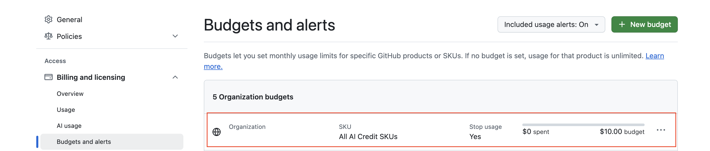

# 6月1日 计费方式变更及带来的影响
> 适用于 GitHub Free Org 用户
> 请务必在6月初完成以下检查和设置，以避免不必要的费用风险

## 计费方式变更
- 6月1日 GitHub Copilot的计费方式已经变更为基于使用量（Token）的计费方式
- 所有用户的额度在组织范围内是共享的
- 默认所有的用户没有限额
- 组织范围也没有限额

更多信息查看[GHCP新计费模式说明](budget-config.md)

## 可能出现的情况
- 用户可以无限量使用造成月底账单很大
- 某个用户短时间内消耗掉组织内所有用户的共享额度

# 建议马上做的操作

需要马上做一个操作：
- **检查并设置每个人的配额**

## 检查并设置每个人的配额
1. 用管理员访问地址 `https://github.com/organizations/<您的组织名称>/settings/copilot/policies`，进入 Copilot 设置页
2. 检查是否开启了 **AI credits paid usage** 选项；如果不希望用户使用的量超过默认的套餐内用量，这里可以关闭 **disable**。
3. 访问 `https://github.com/organizations/<您的组织名称>/settings/billing/budgets`，进入预算设置页
4. 点击右上角的绿色***New Budget***按钮确创建预算：
   - Budget Type选择**AI credits budget** 
   - Budget Scope选择**Users**
   - Budget amount 按实际预期设置，建议先设置30，因为6，7，8三个月copilot for business用户有 30$ 的额度，9月才会恢复成 19$ 额度。也就是说9月份您还需要再来调整一次配额，从30调整到19。
   - 注意，在设置金额**Budget amount**下方有个**Stop usage when user's budget limit is reached**的选项需要勾选
3. 设置完毕后，应该如图：
    

# 其他问题
> 后续会逐渐更新 
## 管理员如何查看每个人的消耗情况
- 费用查看
- Token查看

## 用户如何查看自己的消耗情况
- 费用查看
- Token查看

## 如何调整某些用户的配额 
UI or API
